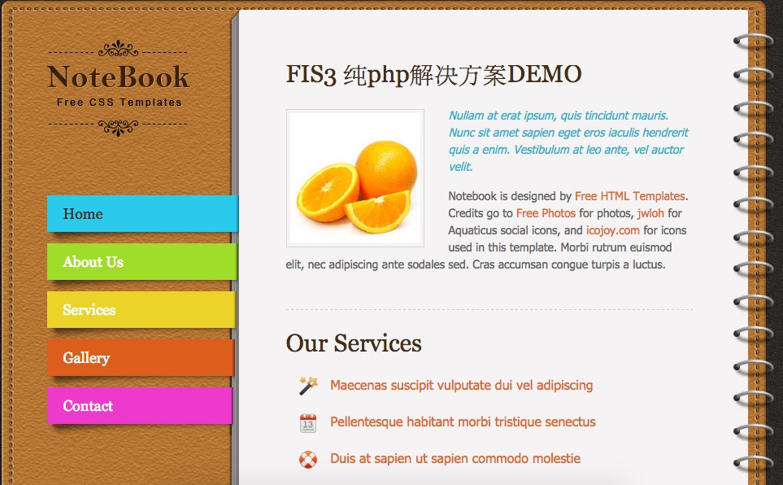

## FIS3纯php静态资源管理方案

---

### 简介

纯php的后端静态资源管理方案，通过与FIS3的结合实现页面组件化、依赖分析与加载、资源收集与自定义渲染等工作。适合中小型项目，您也可以通过学习后端资源管理原理开发适合自己模板的方案(已有smarty、laravel blade、java velocity等方案)。

主题使用的是[免费模板](http://all-free-download.com/free-website-templates/notebook_2495.html)。

**效果截图**



### 开始使用

```
#安装fis3
npm install -g  fis3 

#安装模块化编译插件
cd use-php
npm install 

#编译
fis3 release

#本地预览(php预览需安装java和php-cgi)
fis3 server start

```

注意：如果您没有安装php-cgi和java，您可以把项目发布到apache等本地安装好的服务器目录一样可以预览调试

### 解决什么问题

 - 支持模块化的开发，使用commonJS或者AMD方案来控制前端JS资源的加载
 - 支持组件化开发，使用组件时能自动加载对应依赖的静态资源
 - 自动分析资源依赖关系，确保依赖资源正常下载
 - 自动把css放顶部、JS放底部输出，提升页面渲染性能
 - 支持收集组件中的内嵌样式或脚本，合并输出

### 如何做

**后端如何管理资源信息**

FIS静态资源管理的核心是map表(文件中带`__RESOURCE_MAP__`标记的会自动替换成map表)，里面记录了资源的请求地址、依赖等关键信息，可以根据项目需求添加更多的信息到其中。无论是哪种后端资源管理方案，都是通过读取map表来管理资源。所以本方案通过在`Resource.class.php`中读取map.json文件来分析资源信息。

**如何支持CommonJS/AMD模块化方案**

模块化方案我们选取的是commonjs的modjs方案，因为使用上更加简单。当然支持AMD也很方便，默认编译插件fis-hook-module已支持amd的编译。但需要`Resource.class.php`在页面中输出资源依赖配置时修改成amd的方式，您可以在另一个[laravel解决方案](https://github.com/fis-scaffold/laravel)中学习如何生成amd的配置。

**如何进行组件化开发**

组件化开启了同名依赖，widget里面的组件中，php文件同名的js和css都将标记依赖，加载此widget时对应的资源和依赖都将自动加载。

**如何控制资源输出位置**

css和js的输出采用了标记位来控制，在最终渲染时替换标记位输出静态资源

**其他说明**

文件的合并、压缩、MD5等配置请参照FIS3文档，本方案仅展示php的静态资源管理，不做详细说明。


### 资源管理API

`Resource.class.php`中提供了几个供页面中管理资源的API接口：


 - framework(id) 
    设置前端加载器和模块化规范，如modjs：

    ```php
    <?php framework('static/js/mod.js'); ?>
    ```

 - placeholder(css/js)
   设置标记位，控制css和js的输出位置:

   ```php
    <!-- 标记css输出位置 -->
    <?php placeholder('css');?>

    <!-- js输出位置，放在底部加快页面解析 -->
    <?php placeholder('js'); ?>
   ```

 - widget(id,[array])
    加载某个组件和对应的资源，支持传递数据(可选)到组件中:
    
    ```php
    <!-- 加载组件及对应依赖的js和css -->
    <?php widget("widget/footer/footer.php"); ?>
    ```

 - import(id)
    同步加载css或js资源
    
    ```php
    <!-- 加载css -->
    <?php import('static/css/tooplate_style.css'); ?>
    ```

 - scriptStart、scriptEnd 
   这对函数包裹的内嵌js将合并输出并分析依赖，注意添加`<script>`标记
  
   ```php
    <?php scriptStart(); ?>
    <script type="text/javascript">
      require.async('widget/scroll/scroll.js',function(scroll){
        scroll.init();
      })  
    </script>
    <?php scriptEnd(); ?>

   ```
  
 - styleStart、styleEnd
    这对函数包裹的内嵌css片段将合并输出到指定位置，内嵌css `<style>`标签是可选的

  ```php

    <?php styleStart() ?>
      <style>
        footer{
           margin: *;
        }
      </style>
    <?php styleEnd() ?>
    ``` 

可以查看`page/index.php` 文件，里面有详细的使用示例。
